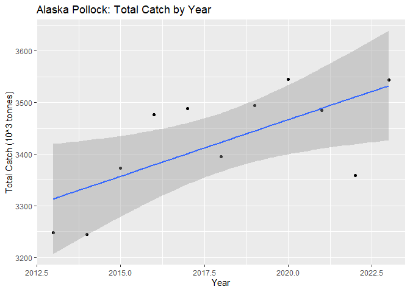

## Instructions
Answer the following questions and/or complete the exercises in RMarkdown. Please embed all of your code and push the final work to your repository. Your report should be organized, clean, and run free from errors. Remember, you must remove the `#` for any included code chunks to run.  

## Load the libraries

``` r
library("tidyverse")
library("janitor")
library("naniar")
options(scipen = 999)
```

## About the Data
For this assignment we are going to work with a data set from the [United Nations Food and Agriculture Organization](https://www.fao.org/fishery/en/collection/capture) on world fisheries. These data were downloaded and cleaned using the `fisheries_clean.Rmd` script.  

Load the data `fisheries_clean.csv` as a new object titled `fisheries_clean`.

``` r
fisheries_clean <- read_csv("data/fisheries_clean.csv")
```

1. Explore the data. What are the names of the variables, what are the dimensions, are there any NA's, what are the classes of the variables, etc.? You may use the functions that you prefer.

``` r
glimpse(fisheries_clean)
```

```
## Rows: 1,055,015
## Columns: 9
## $ period          <dbl> 1950, 1951, 1952, 1953, 1954, 1955, 1956, 1957, 1958, …
## $ continent       <chr> "Asia", "Asia", "Asia", "Asia", "Asia", "Asia", "Asia"…
## $ geo_region      <chr> "Southern Asia", "Southern Asia", "Southern Asia", "So…
## $ country         <chr> "Afghanistan", "Afghanistan", "Afghanistan", "Afghanis…
## $ scientific_name <chr> "Osteichthyes", "Osteichthyes", "Osteichthyes", "Ostei…
## $ common_name     <chr> "Freshwater fishes NEI", "Freshwater fishes NEI", "Fre…
## $ taxonomic_code  <chr> "1990XXXXXXXX106", "1990XXXXXXXX106", "1990XXXXXXXX106…
## $ catch           <dbl> 100, 100, 100, 100, 100, 200, 200, 200, 200, 200, 200,…
## $ status          <chr> "A", "A", "A", "A", "A", "A", "A", "A", "A", "A", "A",…
```

2. Convert the following variables to factors: `period`, `continent`, `geo_region`, `country`, `scientific_name`, `common_name`, `taxonomic_code`, and `status`.

``` r
fisheries_clean <- fisheries_clean %>%
  mutate(across(c(period, continent, geo_region, country, scientific_name, common_name, taxonomic_code, status), as.factor))

glimpse(fisheries_clean) #check work
```

```
## Rows: 1,055,015
## Columns: 9
## $ period          <fct> 1950, 1951, 1952, 1953, 1954, 1955, 1956, 1957, 1958, …
## $ continent       <fct> Asia, Asia, Asia, Asia, Asia, Asia, Asia, Asia, Asia, …
## $ geo_region      <fct> Southern Asia, Southern Asia, Southern Asia, Southern …
## $ country         <fct> "Afghanistan", "Afghanistan", "Afghanistan", "Afghanis…
## $ scientific_name <fct> "Osteichthyes", "Osteichthyes", "Osteichthyes", "Ostei…
## $ common_name     <fct> "Freshwater fishes NEI", "Freshwater fishes NEI", "Fre…
## $ taxonomic_code  <fct> 1990XXXXXXXX106, 1990XXXXXXXX106, 1990XXXXXXXX106, 199…
## $ catch           <dbl> 100, 100, 100, 100, 100, 200, 200, 200, 200, 200, 200,…
## $ status          <fct> A, A, A, A, A, A, A, A, A, A, A, A, A, A, A, A, A, A, …
```

3. Are there any missing values in the data? If so, which variables contain missing values and how many are missing for each variable?

``` r
#skip this for now per instructor's instruction
```

4. How many countries are represented in the data?

``` r
fisheries_clean %>%
  summarize(n_countries=n_distinct(country))
```

```
## # A tibble: 1 × 1
##   n_countries
##         <int>
## 1         249
```

``` r
#There are 249 countries in the data.
```

5. The variables `common_name` and `taxonomic_code` both refer to species. How many unique species are represented in the data based on each of these variables? Are the numbers the same or different?

``` r
fisheries_clean %>%
  summarize(n_species=n_distinct(common_name))
```

```
## # A tibble: 1 × 1
##   n_species
##       <int>
## 1      3390
```

``` r
#There are 3,390 species when using common_name variable.
```


``` r
fisheries_clean %>%
  summarize(n_species=n_distinct(taxonomic_code))
```

```
## # A tibble: 1 × 1
##   n_species
##       <int>
## 1      3722
```

``` r
#There are 3,722 species when using taxonomic_code variable.
#No, the number of species is not the same for the two variables. Common names results in a smaller number of species. This makes sense as common names can repeat (e.g. "Daddy Long Legs" refers to multiple species.)
```


6. In 2023, what were the top five countries that had the highest overall catch?

``` r
fisheries_clean %>%
  filter(period==2023) %>%
  group_by(country) %>%
  summarize(total_catch=sum(catch, na.rm=T)) %>%
  slice_max(total_catch, n=5)
```

```
## # A tibble: 5 × 2
##   country                  total_catch
##   <fct>                          <dbl>
## 1 China                      13424705.
## 2 Indonesia                   7820833.
## 3 India                       6177985.
## 4 Russian Federation          5398032 
## 5 United States of America    4623694
```

7. In 2023, what were the top 10 most caught species? To keep things simple, assume `common_name` is sufficient to identify species. What does `NEI` stand for in some of the common names? How might this be concerning from a fisheries management perspective?

``` r
fisheries_clean %>%
  filter(period==2023) %>%
  group_by(common_name) %>%
  summarize(total_catch=sum(catch, na.rm=T)) %>%
  slice_max(total_catch, n=10)
```

```
## # A tibble: 10 × 2
##    common_name                    total_catch
##    <fct>                                <dbl>
##  1 Marine fishes NEI                 8553907.
##  2 Freshwater fishes NEI             5880104.
##  3 Alaska pollock(=Walleye poll.)    3543411.
##  4 Skipjack tuna                     2954736.
##  5 Anchoveta(=Peruvian anchovy)      2415709.
##  6 Blue whiting(=Poutassou)          1739484.
##  7 Pacific sardine                   1678237.
##  8 Yellowfin tuna                    1601369.
##  9 Atlantic herring                  1432807.
## 10 Scads NEI                         1344190.
```

``` r
#NEI stands for "Not Elsewhere Identified".
#You need to know exactly what kinds of animals are in each group, from a wildlife management perspective. This introduces unknowns about what specifically is in each group that has NEI in its name.
```

8. For the species that was caught the most above (not NEI), which country had the highest catch in 2023?

``` r
fisheries_clean %>%
  filter(common_name=="Alaska pollock(=Walleye poll.)" & period==2023) %>%
  group_by(country) %>%
  summarize(total_catch=sum(catch, na.rm=T)) %>%
  slice_max(total_catch)
```

```
## # A tibble: 1 × 2
##   country            total_catch
##   <fct>                    <dbl>
## 1 Russian Federation     1893924
```

9. How has fishing of this species changed over the last decade (2013-2023)? Create a  plot showing total catch by year for this species.

``` r
fisheries_clean %>%
  mutate(period = as.numeric(as.character(period))) %>%
  filter(common_name=="Alaska pollock(=Walleye poll.)" & (period>=2013 & period<=2023)) %>%
  group_by(period) %>%
  summarize(total_catch=sum(catch, na.rm=T)) %>%
  ggplot(
    mapping=aes(x=period, y=total_catch/1000))+
      geom_point(na.rm=T)+
      geom_smooth(method=lm, se=T)+
      labs(x="Year", y="Total Catch (10^3 tonnes)", title="Alaska Pollock: Total Catch by Year")
```

```
## `geom_smooth()` using formula = 'y ~ x'
```

<!-- -->

``` r
#Fishing has increased over the last decade for Alaska Pollock.
```

10. Perform one exploratory analysis of your choice. Make sure to clearly state the question you are asking before writing any code.

``` r
#Which geographical region caught the most? Is this because the top country is in the top geographical region? Or are there significantly more countries in the top geographical region? Or both?

fisheries_clean %>%  #top geo_regions
  group_by(geo_region) %>%
  summarize(total_catch=sum(catch, na.rm=T)) %>%
  arrange(desc(total_catch))
```

```
## # A tibble: 23 × 2
##    geo_region         total_catch
##    <fct>                    <dbl>
##  1 Eastern Asia       1273628629.
##  2 South America       793953552.
##  3 South-Eastern Asia  694421219.
##  4 Northern Europe     504146497.
##  5 Northern America    419152615.
##  6 Southern Asia       334848338.
##  7 <NA>                297066611.
##  8 Eastern Europe      176716275.
##  9 Southern Europe     135765855.
## 10 Western Europe      112286335.
## # ℹ 13 more rows
```

``` r
fisheries_clean %>%  #check which countries are in Eastern Asia
  filter(geo_region=="Eastern Asia") %>%
  distinct(country)
```

```
## # A tibble: 8 × 1
##   country                              
##   <fct>                                
## 1 China                                
## 2 China, Hong Kong SAR                 
## 3 China, Macao SAR                     
## 4 Taiwan Province of China             
## 5 Japan                                
## 6 Democratic People's Republic of Korea
## 7 Republic of Korea                    
## 8 Mongolia
```

``` r
fisheries_clean %>%  #top country
  group_by(country) %>%
  summarize(total_catch=sum(catch, na.rm=T)) %>%
  arrange(desc(total_catch))
```

```
## # A tibble: 249 × 2
##    country                                      total_catch
##    <fct>                                              <dbl>
##  1 China                                         590740384.
##  2 Japan                                         483676831.
##  3 Peru                                          410295415.
##  4 United States of America                      309146956.
##  5 Union of Soviet Socialist Republics [former]  291034673 
##  6 Indonesia                                     224155486.
##  7 Chile                                         211259930.
##  8 India                                         203857463.
##  9 Norway                                        185335462.
## 10 Russian Federation                            137341803.
## # ℹ 239 more rows
```

``` r
fisheries_clean %>%  #check number of countries per region
  group_by(geo_region) %>%
  summarize(n_countries=n_distinct(country)) %>%
  arrange(desc(n_countries))
```

```
## # A tibble: 23 × 2
##    geo_region         n_countries
##    <fct>                    <int>
##  1 Caribbean                   29
##  2 Eastern Africa              24
##  3 Western Asia                18
##  4 Southern Europe             17
##  5 Western Africa              17
##  6 Northern Europe             15
##  7 South America               14
##  8 Eastern Europe              11
##  9 South-Eastern Asia          11
## 10 Polynesia                   10
## # ℹ 13 more rows
```

``` r
#The top geographical region is Eastern Asia. The top 2 countries are in Eastern Asia (China, Japan). Eastern Asia has fewer countries than most of the geographical regions. So, the reason for Eastern Asia being number 1 is that China and Japan are the top 2.
```

## Knit and Upload
Please knit your work as an .html file and upload to Canvas. Homework is due before the start of the next lab. No late work is accepted. Make sure to use the formatting conventions of RMarkdown to make your report neat and clean!  
